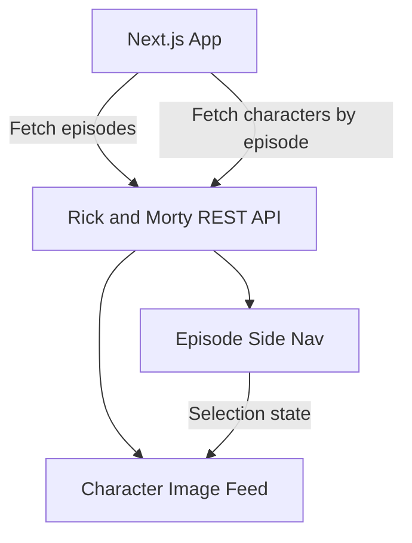

# Rick and Morty Image Feed

A Next.js application that fetches and displays episodes and characters from the public Rick and Morty REST API.  
Built as a frontend engineering exercise focused on API integration, dynamic state management, and interactive UI.

🔗 **Live Demo:** [rickandmorty-diaz-demo.netlify.app](https://rickandmorty-diaz-demo.netlify.app)

---

## Project Status

`Complete` — Built as a frontend technical exercise.

---

## Project Overview

This application implements an interactive image feed driven entirely by a public REST API.  
Users can browse episodes from a side navigation panel and select any episode to update the main view with characters from that episode. The UI responds to selection state without page reloads, demonstrating controlled component patterns and API-driven rendering.

---

## Features & Functionality

- Episode list loaded on initial render from the Rick and Morty REST API
- Clickable episode navigation with active selection highlighting
- Main view dynamically updates character images and names based on selected episode
- Deselecting an episode reverts the view to the default state
- Fully driven by external API data — no local data layer

---

## Architecture



---

## Tech Stack

**Frontend**
- Next.js
- React
- TypeScript
- CSS

**Data**
- [Rick and Morty Public API](https://rickandmortyapi.com/documentation/#rest)

**Deployment**
- Netlify

---

## Engineering Notes

**API-driven state management**  
Episode selection is managed through React state. When an episode is selected, the app fetches the corresponding character data and updates the main view. When deselected, the view reverts to the initial default characters — keeping the UI predictable without additional routing.

**Next.js for a single-view app**  
Next.js was chosen to demonstrate familiarity with the framework in a lightweight context, handling data fetching and rendering within a structured project setup.

---

## Setup Instructions

**Clone the repository**
```bash
git clone https://github.com/diazelena325/rick_morty.git
cd rick_morty
```

**Install dependencies**
```bash
npm install
```

**Start development server**
```bash
npm run dev
```

Open your browser at `http://localhost:3000`

---

## Screenshots

> _See the live demo: [rickandmorty-diaz-demo.netlify.app](https://rickandmorty-diaz-demo.netlify.app)_


